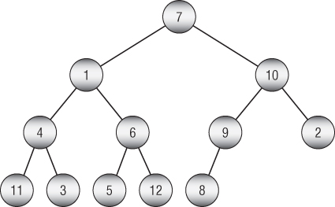
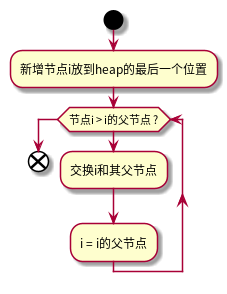
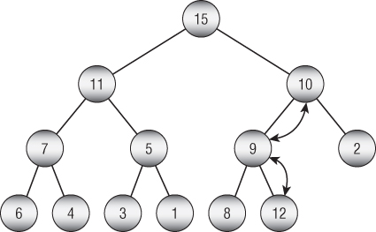
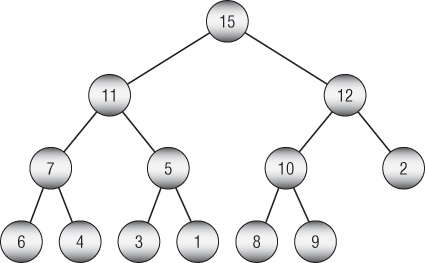

# Table of Contents

1.  [Sort](#org6c9e71f)
    1.  [O(N2))](#org99cb59f)
        1.  [SelectSort](#org8db32aa)
        2.  [InsertSort](#orgf135cb7)
        3.  [BubbleSort](#orgfb4b60e)
    2.  [O(N\*log(N))](#org620dfcb)
        1.  [QuickSort](#orgf15eae9)
        2.  [MergeSort](#orga27536d)
        3.  [HeapSort](#orgcbb7043)
    3.  [Sub O(N\*log(N))](#org6e0d2b2)
        1.  [CountingSort](#org2d40f98)
2.  [Search](#org5762c42)
    1.  [Linear Search](#org0f31dfe)
    2.  [Binary Search](#orgc160a08)
    3.  [Interpolation Search(插值搜索)](#orge964209)
    4.  [Majority Voting](#org93cf329)

# Sort

## O(N2))

### SelectSort

### InsertSort

### BubbleSort

## O(N\*log(N))

### QuickSort

### MergeSort

### HeapSort

堆排序使用"堆"的数据结构, 在数组中排序 **完全二叉树**

1.  排序完全二叉树

2.  完全二叉树的定义

    -   二叉树
    -   除了最底层之外的所有节点都有两个子节点
    -   所有节点都靠左排列
    
    
    
    使用数组表示完全二叉树,对于任意节点下表i,其子节点的序号分别是2\*i+1和2\*(i+1)
    
    对于任意节点j, 它的父节点下标是 &lfloor;(j-1)/2&rfloor; (&lfloor; x &rfloor; 表示floor(x), <=x的最接近整数)
    
    将上面的完全二叉树转换为数组存放, 其结果为:
    
    

3.  Heap(堆)的定义

    Heap是完全二叉树的一种特例-每个节点的值都大于等于它的子节点的值. 亦即对于任何一颗子树来说,它的根节点值都是该子树的最大值.
    
    将上面所示完全二叉树转换为堆结构为:
    
    

4.  堆的操作

    1.  新增节点
    
        对于每个新节点, 将其放置在合适的位置:
        
        
        在上述的Heap中新增节点12的示意如下:
        
        
        
        1.  12放到最后一个位置
        2.  12比其父节点9大, 交换12和9
        3.  交换后12比其父节点10大, 交换12和10;
        4.  12 <= 其父节点15, 新增过程结束
        
        
    
    2.  数组转换为堆
    
        数组转换为堆的过程描述如下:
        
              MakeHeap(Data: values[])
                // Add each item to the heap one at a time.
                For i = 0 To <length of values> - 1
            	// Start at the new item, and work up to the root.
            	Integer: index = i
            	While (index != 0)
            	    // Find the parent's index.
            	    Integer: parent = (index - 1) / 2
            
            	    // If child <= parent, we're done, so
            	    // break out of the While loop.
            	    If (values[index] <= values[parent]) Then Break
            
            	    // Swap the parent and child.
            	    Data: temp = values[index]
            	    values[index] = values[parent]
            	    values[parent] = temp
            
            	    // Move to the parent.
            	    index = parent
            	End While
                Next i
            End MakeHeap 
    
    3.  优先级队列的出队列操作
    
        堆亦可称之为优先级队列(priority queue), 上述新增节点的过程就是入队列的过程, 下面描述出队列的流程
        
        通过上面的描述可以知道, Heap的特性是root节点是最大节点, 所以队列只需要获取root元素的值即可.
        
        复杂一点的是移除了root元素之后, 剩余的两颗子树如何重构成一个Heap. 为了保证新的数是一颗完全平方树, 取其最后一个元素放到现有root的位置, 再从上到下的将其和两个子节点中较大的那个节点进行交换, 使其下沉到合适位置. 该过程和新增节点的操作道理相同, 顺序相反.
        
        出队列的伪代码描述如下:
        
            Data: RemoveTopItem (Data: values[], Integer: count)
                // Save the top item to return later.
                Data: result = values[0]
            
                // Move the last item to the root.
                values[0] = values[count - 1]
            
                // Restore the heap property.
                Integer: index = 0
                While (True)
            	// Find the child indices.
            	Integer: child1 = 2 * index + 1
            	Integer: child2 = 2 * index + 2
            
            	// If a child index is off the end of the tree,
            	// use the parent's index.
            	If (child1 >= count) Then child1 = index
            	If (child2 >= count) Then child2 = index
            
            	// If the heap property is satisfied,
            	// we're done, so break out of the While loop.
            	If ((values[index] >= values[child1]) And
            	    (values[index] >= values[child2])) Then Break
            
            	// Get the index of the child with the larger value.
            	Integer: swap_child
            	If (values[child1] > values[child2]) Then
            	    swap_child = child1
            	Else
            	    swap_child = child2
            
            	// Swap with the larger child.
            	Data: temp = values[index]
            	values[index] = values[swap_child]
            	values[swap_child] = temp
            
            	// Move to the child node.
            	index = swap_child
                End While
            
                // Return the value we removed from the root.
                return result
            End RemoveTopItem 

5.  HeapSort的实现

    明白优先级队列的入队列和出队列操作后, 我们可以很好的理解堆排序的具体流程:
    
    1.  使用数据构造出优先级队列
    2.  不断出队列,直至队列为0
    
    该过程使用伪代码描述如下:
    
        Heapsort(Data: values)
            <Turn the array into a heap.>
        
            For i = <length of values> - 1 To 0 Step -1
        	// Swap the root item and the last item.
        	Data: temp = values[0]
        	values[0] = values[i]
        	values[i] = temp
        
        	<Consider the item in position i to be removed from the heap,
        	 so the heap now holds i - 1 items. Push the new root value
        	 down into the heap to restore the heap property.>
            Next i
        End Heapsort 

6.  复杂度分析

    1.  空间复杂度
    
        假设输入N个数据, 则HeapSort算法使用大小为N的数组进行数据处理, 因此空间复杂度为O(N).
    
    2.  时间复杂度
    
        分为两个阶段来考虑:
        
        1.  使用输入数据构造Heap
            对于任意节点, 首先将其放到当前Heap的最后位置, 再向上提升, 提升的最大层数为log2(N);所以N个节点整个构造时间复杂度为N\*log(N)
        
        2.  出队列
            每次出队列, 相当于讲最后元素放到root位置, 在向下沉淀, 下降的最大层数为log2(N); 所以N个节点出队列的时间复杂度为N\*log(N)
        
        因此, HeapSort的时间复杂度为N\*log(N) + N\*log(N); 亦即N\*log(N)

## Sub O(N\*log(N))

对于N个元素的比较排序, 算法的时间复杂度不可能小于N\*log(N), 但是非比较排序则可能低于这个量级.

### CountingSort

对于要排序的元素其分布在一个较小的区间中时, 可使用CountingSort.

# Search

## Linear Search

## Binary Search

## Interpolation Search(插值搜索)

1000个100以内的数字,搜索77的示例.

    Integer: InterpolationSearch(Data values[], Data target)
        Integer: min = 0
        Integer: max = values.Length - 1
        While (min <= max)
    	// Find the dividing item.
    	Integer: mid = min + (max - min) *
    	    (target - values[min]) / (values[max] - values[min])
    
    	If (values[mid] == target) Then Return mid
    
    	<Set min or max to search the left or right half.>
        End While
    
        Return -1
    End InterpolationSearch 

## Majority Voting

假设投票中有一个选项会超过投票数的一半

怎么获取超过一半的这个选项???

    Outcome: BoyerMooreVote(List<Outcome> outcomes)
        Outcome: majority = ""
        Integer: counter = 0
        For Each outcome In outcomes
    	If (counter == 0) Then
    	    majority = outcome
    	    counter = 1
    	Else If (outcome == majority) Then
    	    counter++
    	Else
    	    counter--
    	End If
        Next outcome
    
        Return majority
    End BoyerMooreVote 

